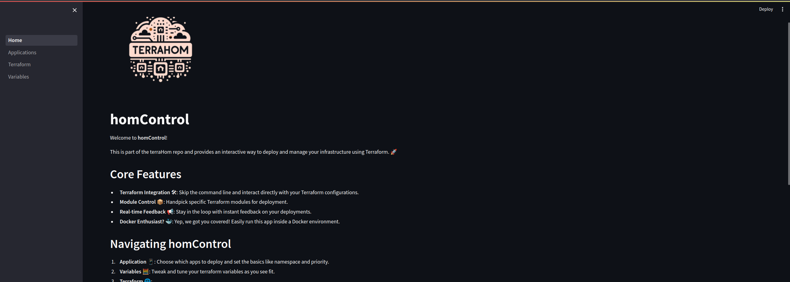
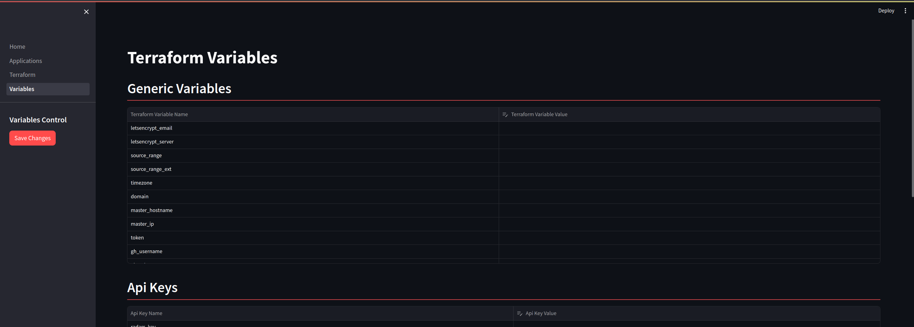
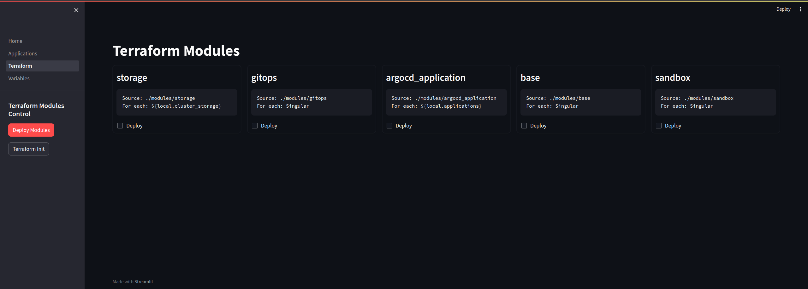
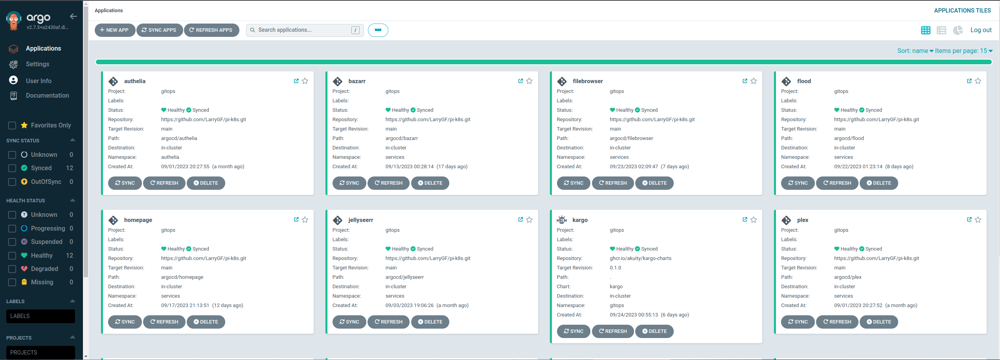

# terraHom

<p align="left">
  
</p>

_Mostly_ Automated setup to deploy _k3s_ and additional services on your home cluster using `homControl`.

## Table of Contents

- [terraHom](#terrahom)
  - [Table of Contents](#table-of-contents)
  - [Terminology 📖](#terminology-)
  - [Pre-deployment 🚀](#pre-deployment-)
    - [Basic node setup 🛠](#basic-node-setup-)
      - [Control Node](#control-node)
      - [Managed Nodes](#managed-nodes)
        - [Domain and public IP](#domain-and-public-ip)
    - [Storage 🛠](#storage-)
    - [VPN Setup 🛠](#vpn-setup-)
      - [Obtaining the VPN config](#obtaining-the-vpn-config)
  - [Automated Deployment 🚀](#automated-deployment-)
    - [(Non-exhaustive) Requirements 🛠](#non-exhaustive-requirements-)
    - [Ansible 🛠](#ansible-)
    - [homControl 🛠](#homcontrol-)
      - [Launching homControl](#launching-homcontrol)
      - [Setting up Variables](#setting-up-variables)
      - [Terraform modules](#terraform-modules)
        - [Modules description](#modules-description)
      - [ArgoCd Applications](#argocd-applications)
      - [Accessing ArgoCD](#accessing-argocd)
  - [Post Install 🚀](#post-install-)
  - [Troubleshooting 🚀](#troubleshooting-)
  - [Expanding the repo 🚀](#expanding-the-repo-)

## Terminology 📖

- **Control Node:** Your local computer. Most actions are executed from here.
- **Managed Nodes:** These are your [Kubernetes](https://kubernetes.io/) cluster nodes where services are deployed.
  - **Master node(s):** The control plane for your Kubernetes cluster. This is where the cluster's management functions take place.
  - **Agent node(s):** Worker nodes where most services run.
  - **Storage node(s):** Can be either `master` or `agent` nodes. Represents nodes with attached external storage.

## Pre-deployment 🚀

### Basic node setup 🛠

Ensure you follow these steps in sequence before proceeding further, as they are crucial for the automation to work seamlessly.

#### Control Node

- Install [Ansible](https://docs.ansible.com/ansible/latest/installation_guide/intro_installation.html) (only required if you're planning to use the playbooks).
- Install [Terraform](https://learn.hashicorp.com/tutorials/terraform/install-cli) (only required if you're not planning to use the [homControl](#homcontrol-)).
- Install [kubectl](https://kubernetes.io/docs/tasks/tools/install-kubectl/).

#### Managed Nodes

- Flash/Install [Debian GNU/Linux 11 (bullseye)](https://www.debian.org/) on the nodes (depending on your node's CPU you might need to flash an `amd64` or `arm64` image).
- Connect the node to your network.
- Set up password-less [SSH](https://www.cyberciti.biz/faq/how-to-set-up-ssh-keys-on-linux-unix/) (this step is done from your `Control node`):

  ```bash
  ssh-copy-id {your username}@<NODE_IP>
  ```

  - It is strongly recommended that you use the same username in your `Control node` and your `Managed nodes`. [Ansible playbooks](https://docs.ansible.com/ansible/latest/playbook_guide/playbooks_intro.html) will also make changes on your local filesystem, so avoid unnecessary privilege escalation.
  
- Add your user to the `sudo` group:

  ```bash
  # as root
  usermod -aG sudo {your username}
  ```

- Grant `sudoers` permission to run commands without a password:

  - Run:
  
    ```bash
    # as root
    visudo
    ```

  - Add or modify this line in the file:

    ```bash
    %sudo ALL=(ALL) NOPASSWD:ALL
    ```

  - Alternatively, you can directly edit `/etc/sudoers`.

- Ensure the `CD-ROM` entry in `/etc/apt/sources.list` is disabled to prevent system update failures.

- Create your free public domain for valid [SSL certificates](https://www.kaspersky.com/resource-center/definitions/what-is-a-ssl-certificate). If you don't want external access, check [this](#domain-and-public-ip).
  
  - DuckDNS (deprecated):
    - Register on duckdns.org.
    - Set up your subdomain and note down the subdomain and token.
  
  - DeSec:
    - Register on [DeSec](https://desec.io/).
    - Set up your domain and save your subdomain for later.
    - Create a wildcard record targeting your **public IP address** (Find it [here](https://www.whatsmyip.org/)).
    - Once set up, a service will be deployed to auto-update this IP.
    - In the webpage, go to `Token management`, create and note down your token.

- Direct your public IP to your cluster (might be limited if your ISP _NATs_ your public IP).
  
  - Achieve this by [Port Forwarding](https://nordvpn.com/blog/port-forwarding/) ports `80`/`443` on your router to your `Master node`'s IP.
  
  - If your IP is _NATed_, consider a static IP or deploy with self-signed certificates.
  
    - Test by forwarding port `8080` to your `Control node` and run:

      ```bash
      python -m http.server 8080
      ```
  
    - Access `http://{your public ip}:8080`. If there's an error and you've followed steps correctly, your IP might be `CG-NATed` by the ISP.

##### Domain and public IP

The main reasons for us to get a domain name are:

- To be able to automatically generate SSL certificates for our services and get rid of the browser notification that we're using insecure certificates
- In case you want to be able to share some (or all) of your services with friends or access them when away from home without having to deal with a VPN

There are measures in place to improve security and restrict access to your services from outside your network, but it's still a security risk so use it with caution and I strongly advise to leave anything sensitive exclusively on your private network.

If you already own a domain name or want to use a different solution for your free domain, you should be able to do it without having to deviate from the steps here.

If you are planning on deploying this on an [Air gapped environment](https://en.wikipedia.org/wiki/Air_gap_(networking)), a possible solution to achieve this result could be to create your domain, generate a wildcard certificate (*.{your_domain}) and to use that certificate in your cluster for all services (this alternative won't be covered in the documentation).

### Storage 🛠

This is only necessary if you want to use longhorn. *_*I don't recommend using longhorn for single node deployments*_.

- Attach your external hard drive(s) or create and format a partition on your `storage` node(s) and take note of the partition's names

If you're planning on adding any additional drives later that's totally fine, and they can be added manually from the Longhorn UI, or from ansible, only thing to keep in mind is that if you are planning on using Longhorn from the beginning, you should at least have one storage node so the correct Peristent Volume Claims get created and you won't risk losing any data.

### VPN Setup 🛠

Some modules (`rtorrent` for now), have a Wireguard VPN addon, in order for this to work you need to pass it the Wireguard config. The wireguard config will be stored as a Kubernetes secret and mounted in the container, you need to pass the contents of the config file as a `base64` encoded string, you can get this string by running:

```bash
cat wireguard.config | base64
```

and then adding to your `terraform.tfvars`:

```hcl
vpn_config = "{b64 encoded string}"
```

#### Obtaining the VPN config

Your VPN provider should have a config file available for you to use, it should be a simple Google Search away. If you don't have one already you can use [Proton VPN](https://protonvpn.com/https://protonvpn.com/) that offers a free plan and lets you easily download the Wireguard [config file](https://protonvpn.com/support/wireguard-configurations/).

If you are like me and are stuck with NordVPN for the foreseeable future, you would have realized already that there's no easy way to get the config file. That's why this repo has a `git submodule` under `scripts/NordVPN-Wireguard` that will let you generate the config file yourself. You can find the instructions on how to use it in the [README](./scripts/NordVPN-Wireguard/README.md).

## Automated Deployment 🚀

This section covers the `k3s` installation using [ansible playbooks](#ansible-) and the deployment of the services using a mix of Terraform and ArgoCD, made easier by using [homControl](#homcontrol-). The playbooks are in charge of preparing the environment, installing required packages, tagging nodes and making the necessary local changes in order for terraform to work (variable creation, kubeconfig creation, etc.) unless you know what you're doing it is strongly advised to install everything using the provided playbooks. In case you want to skip this here is a list of some resource that could be missing, but I might have missed something:

### (Non-exhaustive) Requirements 🛠

- [Longhorn](https://staging--longhornio.netlify.app/docs/0.8.1/deploy/install/#installation-requirements)

### Ansible 🛠

If you're planning on manually installing kubernetes or if you already have a kubernetes cluster you can skip this section and go straight to [homControl](#homcontrol-). Just make sure that everything is matching to what `ansible` would have created (especially installing dependencies and tagging of resources)

1. Create `ansible/inventory/deploy/group_vars/all.yml` with the following:

    ```yaml
    ---
    # Specifies the k3s version to be installed.
    k3s_version: "v1.26.3+k3s1"

    # Directory for systemd service files.
    systemd_dir: "/etc/systemd/system"

    # IP of the master node, retrieved from Ansible's dynamic inventory.
    master_ip: "{{ hostvars[groups['master'][0]]['ansible_host'] | default(groups['master'][0]) }}"

    # Arguments to customize the k3s server behavior. 
    # Leave these default values unless you know what you're doing
    extra_server_args: "--disable traefik --prefer-bundled-bin --kube-controller-manager-arg bind-address=0.0.0.0 --kube-proxy-arg metrics-bind-address=0.0.0.0 --kube-scheduler-arg bind-address=0.0.0.0" 

    # Arguments for additional k3s agent configuration.
    # Leave these default values unless you know what you're doing
    extra_agent_args: ""

    # System timezone configuration for k3s nodes.
    timezone: 'UTC' # Change to your desired timezone.

    # Partition for NFS storage, ensure it is formatted and available.
    nfs_drive_partition: "nvme0n1p1" # Example partition.

    # Networks permitted for SSH access to the nodes.
    allowed_ssh_networks:
      - "10.22.0.0/16"
      - "172.16.100.0/24"

    # ZeroTier network ID for node communication.
    zerotier_network_id: "1234567890abcdef" # Example network ID.
    ```

2. Create `ansible/inventory/deploy/hosts.yaml` with the following:

   ```yaml
   ---
   # The ungrouped section can contain hosts that don't fit into any other group.
   ungrouped:
     hosts: {}

   # Define the master nodes for the k3s cluster. (Multi master is still a WIP, so only define one for now)
   master:
     hosts:
       kilvin:
         ansible_host: 192.168.x.x # Master node IP.
         ansible_user: admin # Replace with the actual username.
         ansible_become_pass: secret # Replace with the actual sudo password.
         priority: critical # Node priority for orchestration.
         disks:
           - device: sda3 # Device identifier for storage.
             path: /mnt/external-disk # Mount path for the device.
             name: root # Name label for the disk.
             longhorn: true # Indicates Longhorn manages this disk.

   # Define the agent nodes for the k3s cluster.
   agent:
     hosts:
       kvothe:
         ansible_host: 192.168.x.y # Agent node IP.
         ansible_user: admin # Replace with the actual username.
         ansible_become_pass: secret # Replace with the actual sudo password.
         priority: low # Node priority for orchestration.
         k3s_node_external_ip: 10.242.x.z # Required for multi-cloud clusters, typically used with ZeroTier.
         disks: [] # List of disk configurations for the node.
       elodin:
         ansible_host: 192.168.x.z # Agent node IP.
         ansible_user: admin # Replace with the actual username.
         ansible_become_pass: secret # Replace with the actual sudo password.
         priority: high # Node priority for orchestration.
         disks:
           - device: nvme0n1p3 # Device identifier for storage.
             path: /mnt/external-disk # Mount path for the device.
             name: elodin-root # Name label for the disk.
             longhorn: false # Indicates this disk will not be managed by Longhorn.

   # Group definitions for the kubernetes nodes.
   k3s:
     children:
       master:
       agent:

   # Group definitions for nodes contributing storage resources.
   storage:
     hosts:
       kvothe:
       elodin:
     children:
       master:

   # Group definitions for nodes that are part of a ZeroTier network.
   zerotier:
     children:
       agent:
       master:
   ```

   - When `longhorn` is set to `true`, the disk will be managed by Longhorn, which means it will be used for dynamic volume provisioning and managed as part of Longhorn's distributed storage system.
   - When `longhorn` is set to `false`, the disk will not be managed by Longhorn; what will happen is that the disk will be exposed over NFS and will be added to the `terraform.tfvars` and used to create kubernetes PVCs.
   - The `zerotier` group is optional. It is used to create an overlay network that connects all of your nodes, even if they are on different networks or behind NAT. You can comment this out if you're not planning on using it.
   - If `zerotier` is configured, `k3s_node_external_ip` should be set to the node's IP within the ZeroTier network. This IP will be used for cross-node communication within the overlay network, allowing services to communicate across different clouds or data centers as if they were in the same local network.
   - The priority should be one of [critical,high,low]

3. Run the ansible playbook (from the root of the repo):
  
   ```bash
   ansible-playbook ./ansible/site.yml -i ./ansible/inventory/deploy/hosts.yaml
   ```

4. Once the playbook finishes you can verify if everything is working by running:
  
     ```bash
     ❯ kubectl get nodes
      NAME     STATUS   ROLES                  AGE    VERSION
      kilvin   Ready    control-plane,master   168d   v1.26.3+k3s1
      kvothe   Ready    worker                 20d    v1.26.3+k3s1
      elodin   Ready    worker                 20d    v1.26.3+k3s1
     ```

5. Verify that everything ran as expected, some of the next steps won't be executed if all roles don't finish running succesfully on all hosts

6. (Optional) All of the plays have been tagged, so, if you want to make any changes and don't want to run everything again you can just run plays matching specific tags:
  
   ```bash
   ansible-playbook ./ansible/site.yml -i ./ansible/inventory/deploy/hosts.yaml --tags kubernetes,download
   
   ```

### homControl 🛠

Ansible just installs kubernetes and makes the necessary configurations, but doesn't deploy anything to the cluster, as a matter of fact, by default the playbook even skips some components that come with `k3s` by default to allow for a fresh, fully customized deployment.

The automation of the deployments has shifted from direct Terraform usage to being managed by  `homControl`,  `homControl` is a web application that comes bundled within the repository, designed to streamline and automate part of the deployment process . It achieves this by loading your terraform files, letting you modify them and run the changes programmatically from the web UI instead of manually from the _cli_.

#### Launching homControl

The homControl application, built on streamlit, is designed to run inside a Docker container. To launch homControl from your Control Node, execute the following command at the root of the repository:

```bash
./homControl.sh
```

Executing this script will:

- Install the Python dependencies to run the script
- Execute the ./scripts/python/homControl.py script, which will:
  - Check for any running instances of homControl, terminate and remove them if found.
  - Build a fresh homControl Docker image, then run the container and open the app in your browser.

Once launched, you'll be greeted with the homControl landing page as shown below:



#### Setting up Variables

`homControl` looks for one of these files to load your Terraform variables:

- `terraform/terraform.tfvars.json`: Primary file used for deployments.
- `terraform/terraform.tfvars`:  In absence of the .json file, it will use this file's values to generate the JSON variant.
- `terraform/terraform.tfvars.example`: For first-time users without any setup, it serves as a template to initialize all variables with placeholder values.

Navigate to the Variables page to view and edit these variables as shown below:



For details on each variable's function, refer to [here](./docs/Variables.md). If it's your first time deploying the modules, you can skip the `Api Keys` section since these need to be filled after the services have been deployed.

To save your variable configurations, click Save changes, which will either create or update the `terraform.tfvars.json` file.

#### Terraform modules

`homControl` will be in charge of running your Terraform modules, you can run them all at once, or individually. Navigating to the `Terraform` page will show the following:



The process of deploying your infrastructure is pretty straightforward, you just have to:

- (Optional) If it's your first time running this you should click on `Terraform Init` to initialize Terraform
- Select the module(s) to deploy
- Click on `Deploy Modules`. Clicking on this button will:
  - Generate a plan using the selected modules as _targets_
  - Display a summarized prediction of changes for your approval
  - Once confirmed it will apply the changes

While deploying all modules at once is possible, it's advisable to deploy them sequentially to ensure each module functions correctly before proceeding.

##### Modules description

Here's what you need to know about each module:

1. **Base**

   As its name implies, the `base` module deploys the base services needed for the rest of the applications to run, it also creates all the namespaces that will be used. There are many submodules, some are deprecated and not currently in use, but the code is still there in case anyone finds it helpful. The submodules deployed are:

   - Cert-manager: this module deploys a ClusterIssuer that generates certificates using LetsEncrypt for all of your ingresses.
   - Traefik: this module deploys a modified `traefik` LoadBalancer, replacing the `traefik` that comes with `k3s` by default. It also deploys several middlewares:
     - Error pages: this also deploys an `error pages` service that shows a custom error page and comes as a default view for any HTTP error that traefik shows
     - Ip Whitelist: this will only allow traffic from the subnets/IPs defined in `terraform.tfvars`. By default this will always fetch and add your public IP to the whitelists at run time. It also adds the IP ranges for Cloudflare servers for future Cloudflare integrations
     - Redirect https: this will redirect all `http` to `https`
   - Longhorn: this modules installs and configures `longhorn`
   - Prometheus-CRDS: this just installs some additional CustomResourceDefinitions that at this moment of the deployment are not present in the cluster in order to create ServiceMonitors, PrometheusRules, etc
   - DDclient: this module is in charge of updating your domain to always point to your public IP
   - Adguard Home: this module deploys `Adguard Home` with pre-configured lists and can act as your local DNS server. Be sure to add `nameserver {master node ip}` to the `/etc/resolve.conf` in your `control node`.
   - ArgoCD: this module deploys `ArgoCD` to your cluster. Once this module has been installed it will be used to deploy all of the other applications to your cluster.

   If it complains about missing CRDs you can install them by running and then redeploy the module:

   ```bash
   kubectl apply -f https://github.com/cert-manager/cert-manager/releases/download/v1.11.0/cert-manager.crds.yaml
   kubectl apply -f https://raw.githubusercontent.com/traefik/traefik/v2.10/docs/content/reference/dynamic-configuration/kubernetes-crd-rbac.yml
   kubectl apply -f https://raw.githubusercontent.com/traefik/traefik/v2.10/docs/content/reference/dynamic-configuration/kubernetes-crd-definition-v1.yml
   ```

2. **Storage**

   The `Storage` module is in charge of handling the CRUD process of kubernetes persistent volumes that are not managed by `Longhorn` directly. This module will use the disk information that was automatically added by `ansible` to your `.tfvars` at installation time and let your Kubernetes pods access your disks through NFS.

3. **Gitops**

   The `Gitops` module is responsible for configuring `ArgoCD` and making it usable: it creates default repositories, repository credentials, projects and permissions. It is also tasked with initializing the `ArgoCD` provider with the correct credentials removing that responsibility from the next module.

4. **ArgoCD Application**

   This is where the interesting part happens, this module is responsible for deploying your applications, it achieves this by making `Terraform` and `ArgoCD` work together, running this module will deploy **all** the services that you enable, if you're not interested in knowing how this module works, you can go straight  to the [next section](#argocd-applications).

   Below is a more in-depth explanation of how it works and its components:

   - `applications.yaml`: this `YAML` contains the configuration for all of the applications that can be deployed, from here you can control if an application will be deployed or not, where will it be deployed (namespace and node), persistence, as well as values to be overwritten.

   - For each application marked to be deployed the module creates an `Application` CRD that will get picked up and deployed by `ArgoCD` following these steps:
     - Each application is declared as an [umbrella-chart](https://helm.sh/docs/howto/charts_tips_and_tricks/#complex-charts-with-many-dependencies) inside the `argocd` folder in the root of the repo. This allows us to take advantage of this new `umbrella chart` to install any additional desired kubernetes manifests, and provide basic configuration to the chart using the `values.common.yaml`
     - Each application also has a counterpart inside `terraform/modules/argocd_application/applications`, this allows us to use terraform variables and data to further configure the `ArgoCD` application without having to explicitly declare anything extra (this is done through the `override` key for each application in `applications.yaml`)
     - If the application has volumes declared it will create any necessary PVCs with the desired configs (if Longhorn is enabled it will use the `longhorn` `StorageClass`, otherwise will use the `local-path` `StorageClass`)

   - Each application in the repo should work out of the box and they come pre-configured to work fine in this particular environment, so they should work well together. Of course, they come with a highly opinionated configuration, so you're always free to make any changes.

   You can read the [Applications](./docs/Applications.md) file to find out what each application does and which ones are enabled by default.

   It is worth noting that the helm charts deployed as part of the `base` module won't be visible in `ArgoCD` since they weren't created using `Applications` but directly installed using helm charts from `Terraform`. The same thing happens with the `PersistentVolumes` and `PersistentVolumeClaims`, they are not visible as a resource in `ArgoCD` since they were created from `Terraform` and are just being referenced as an existing `PVC` in the helm values file, but they will be visible from `Longhorn`'s UI.

   At this point everything should be up and running, if you face any issues you can head to the [Troubleshooting section](#troubleshooting-), and if that doesn't solve your problem feel free to open an issue in the repo or write an email and I will do my best to help you.

#### ArgoCd Applications

This section allows you to manage the deployment of applications within `ArgoCD`, if you want a more advanced approach you will have to manually edit your `applications.yaml`.

Below is a picture of what you will see once you get into the `Applications` page:


As you can see in the picture you can:

- Use `Enable all` or `Disable all` for batch operations.
- Modify which applications are going to be deployed:
  - By clicking on the `Deploy` check-mark of each application you control if they get deployed or not
  - Change the namespace to which they will be deployed
  - Change their "priority". This is just a `nodeSelector` that forces them to run in nodes with a matching priority
  - Under the `Volumes` section you can enable/disable the creation of predefined persistent volumes

Remember to `Save changes` to make your configuration persistent. After editing, redeploy the argocd_application module by revisiting [these steps](#terraform-modules).

#### Accessing ArgoCD

- First thing you need to do is to get the admin user's password by running:

```shell
kubectl get secret argocd-initial-admin-secret -o jsonpath='{.data.password}' -n gitops | base64 -d
```

- You will get a string in this form: `y3hGrasC0123LXc-%` be sure not to copy the `%` since that is not part of the password
- Once you have that you can go to `https://argo.{your_domain}/`, login as `admin` with the previously obtained password and you will be greeted by this screen:
  

- Alternatively, if you are deploying the default applications, or at least the `homepage` application, you can head to `https://home.{your_domain}/` where you will find a dashboard that will automatically update with links to your deployed services:
  

## Post Install 🚀

Read the [Post-Install](./docs/Post-Install.md) file to see any additional configs for some of the services to be deployed

## Troubleshooting 🚀

Read the [Troubleshooting](./docs/Troubleshooting.md) file to find solutions to common problems.

## Expanding the repo 🚀

Read the [Expanding](./docs/Expanding.md) file to find a more in-depth explanation on how things work and how to add your own services and functionalities.
