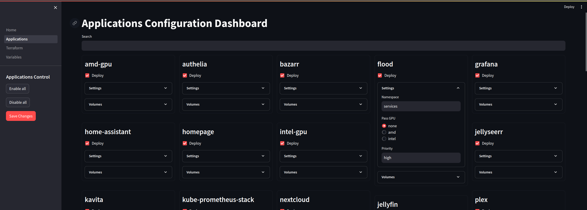

# terraHom

  

_Mostly_ Automated setup to deploy _k3s_ and additional services on your home cluster using `homControl`.

You can follow [the wiki](https://github.com/LarryGF/terraHom/wiki) for installation, configuration and troubleshooting guides.

## Components

It has plenty of tools and services that come pre-configured to try and make your home cluster as secure and easy to use as possible, all of them deployed through a simple web UI. 

New services and functionalities are constantly being added, you can also bring your own, feel free to contribute! 

Here are some of my favorite features:

### Security

- **[AdGuard home](https://adguard.com/en/adguard-home/overview.html)**: Local AdBlocker
- **[Traefik](https://traefik.io/)**: Load Balancer/Reverse Proxy with source whitelisting features
- **[Authelia](https://www.authelia.com/)**: Multi Factor Authentication for your services

### Cluster Management

- **[Rancher](https://www.rancher.com/)**: Manage your Kubernetes cluster from a web UI
- **[ArgoCD](https://argo-cd.readthedocs.io/en/stable/)**: Control your cluster apps with a GitOps approach
- **[Longhorn](https://longhorn.io/)**: Manage your cluster's persistence in a distributed manner

### Monitoring

 

- **[Grafana](https://grafana.com/)**: Observe your cluster, pre-configured out-of-the-box
- **[Prometheus](https://prometheus.io/)**: Gather metrics from your cluster automatically using ServiceMonitors and PodMonitors
- **[Alertmanager](https://prometheus.io/docs/alerting/latest/alertmanager/)**: Get notified about the events in your cluster with little to no config necessary

### Media

- **[Plex](https://www.plex.tv/)**: Stream your local media from your phone, computer, or the web
- **[Jellyseerr](https://github.com/Fallenbagel/jellyseerr)**: Provides an easy way for you or your friends to request new movies or tv shows to be added to your media library
- **[SABnzbd](https://sabnzbd.org/)**: Lets you manage your UseNet downloads

- **[Sonarr](https://sonarr.tv/#home)**: Internet PVR for Usenet and Torrents, handles TV shows
- **[Radarr](https://radarr.video/)**: Internet PVR for Usenet and Torrents, handles movies

### Visibility

- **[Homepage](https://gethomepage.dev/)**: this dashboard will populate automatically with your services, and, after some minimal configuration, you will be able to use the widgets to get information about your applications at a glance
